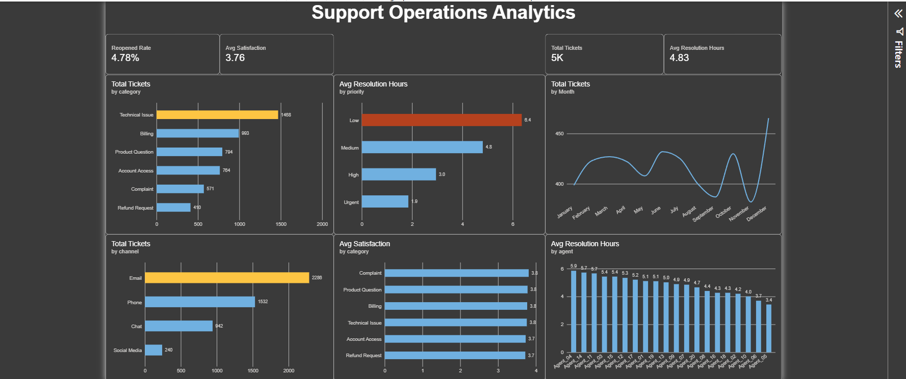
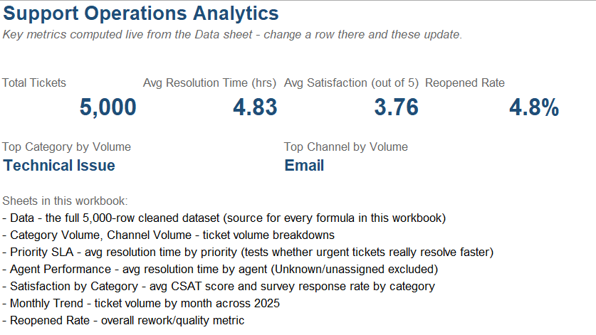
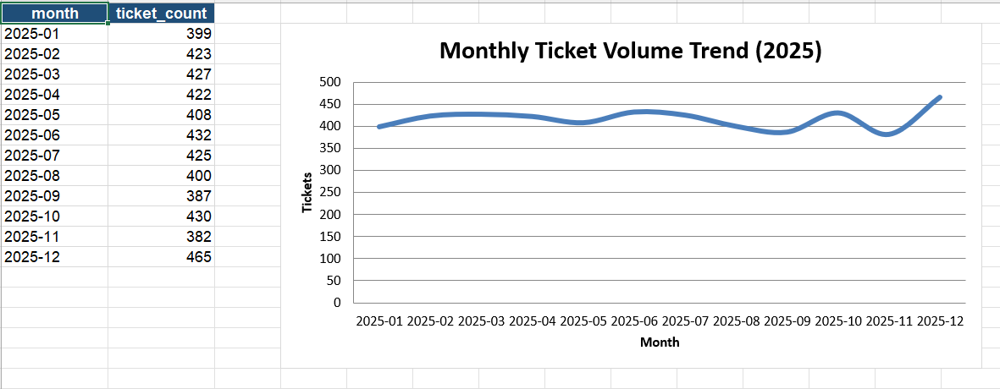

# Support Operations Analytics

An end-to-end analytics project simulating a company's customer support helpdesk: synthetic ticket data → deliberately messy export → documented cleaning → relational database → SQL-driven KPI analysis → Excel and Power BI dashboards. Built as a portfolio project for Data Analyst / BI roles.

## Dashboards

**Power BI**



**Excel**




## Two data bugs caught and fixed during analysis

Anyone can group data and draw a bar chart. The part of this project I'd point to first is that two of the KPI numbers were quietly wrong at first, and I caught both before they made it into a dashboard.

**Silent line-ending bug — the reopened-ticket-rate query returned 0 reopened tickets** despite `GROUP BY status` clearly showing 239 rows with status `'Reopened'`. Root cause: the source CSV uses Windows-style `\r\n` line endings, but the original `LOAD DATA` script only declared `\n` as the line terminator — leaving a stray, invisible carriage return glued onto every value in the last column (`status`). `GROUP BY`/`COUNT` still worked fine (they just bucket identical values, whatever they are), but any exact-match filter against `'Reopened'` silently matched nothing. Fixed both the already-loaded data (`UPDATE ... REPLACE(status, '\r', '')`) and the load script itself (`LINES TERMINATED BY '\r\n'`) so it can't recur on a fresh load. (`sql/01_schema_and_load.sql`)

**Hidden agent-count mismatch — grouping tickets by agent returned 21 rows instead of the expected 20.** Traced it to the `'Unknown'` placeholder agent (used during cleaning for tickets with no agent assigned) legitimately being counted as its own group. Confirmed that was correct behavior given the data, then explicitly excluded it from the per-agent performance KPI so unassigned tickets aren't ranked against real agents. (`sql/02_kpi_queries.sql`, KPI 3)

## Business problem

A support team wants to understand: which categories and channels drive the most ticket volume, whether tickets are actually resolved faster when marked high priority, how agents compare on resolution time, how customer satisfaction varies by issue type, and how often tickets have to be reopened. This project answers each of those with real SQL against a real database, then visualizes them in Excel and Power BI.

## Key findings and what I'd do about them

- **Priority-based triage is working as intended:** Urgent tickets resolve in **1.85 hours** on average versus **6.36 hours** for Low priority — roughly 3.4x faster, confirming the prioritization logic actually affects outcomes rather than being cosmetic. *Worth watching: 6.36 hours for Low priority is still the slowest tier — worth confirming that's within whatever SLA target exists for that tier before it's treated as fine by default.*
- **Technical Issue is the leading driver of ticket volume** (1,468 tickets, ~29%), followed by Billing (993) and Product Question (794). *If ticket deflection is a goal, this is the category to target first with self-service content or a knowledge base — it's nearly 50% larger than the next biggest category.*
- **Email is the dominant support channel** (2,286 tickets, ~46%), more than Phone and Chat combined. *Worth checking whether email response times and staffing are sized for that share, since it's easy to under-resource the "quiet" channel that isn't ringing a phone.*
- **Customer satisfaction is stable across categories** (3.72–3.81 out of 5) — no single category stands out as a major pain point, though survey response rates hover around 64–67%, meaning roughly a third of tickets have no satisfaction signal at all. *The response-rate gap matters more than the score itself here — a third of the picture is missing, and that non-response could be masking a worse experience in whichever segment tends to skip the survey.*
- **4.78% of tickets get reopened** (239 of 5,000) — a rework/quality baseline worth tracking over time once more data is available. *A natural next question this dataset can't answer yet: is the reopen rate concentrated in a specific category or agent, or spread evenly? That's a one-line SQL query away and would turn this from a single number into an actionable target.*

## Dataset

5,000 synthetic support tickets covering all of 2025 (`data/`). Each ticket has a channel (Email/Phone/Chat/Social Media), category (Billing/Technical Issue/Account Access/Product Question/Complaint/Refund Request), priority (Low/Medium/High/Urgent), assigned agent (20 agents), resolution time, a 1–5 customer satisfaction score (often missing — real CSAT surveys have low response rates), and a status (Resolved/Closed/Reopened).

The data is synthetic (`data/generate_data.py`, seeded for reproducibility) rather than scraped or copied from an existing public dataset, deliberately built to avoid the cliche datasets (Titanic, generic COVID trackers) that show up in most portfolios.

## Data quality: messy-in, clean-out

A second script (`data/generate_messy_data.py`) intentionally reintroduces the kind of mess real exported data always has: ~100 duplicate ticket exports, inconsistent category text (case, whitespace, typos), ~50 tickets with no assigned agent, ~1,800 missing satisfaction scores, and 10 physically-impossible negative resolution times.

`notebooks/01_data_cleaning.ipynb` documents the full cleaning pipeline with the reasoning behind every fix — not just what was done, but why:

| Issue | Fix | Why |
|---|---|---|
| Duplicate `ticket_id` | Drop, keep first | Same ticket exported twice isn't two tickets |
| Inconsistent category text | Normalize to 6 canonical values | Lookup table handles case, whitespace, and known typos |
| Negative resolution time | Take absolute value | Clear sign-flip data-entry error, not a real negative duration |
| Missing agent | Fill with `'Unknown'` | Kept visible rather than silently dropped; excluded from per-agent KPIs since it isn't a real agent |
| Missing satisfaction score | Left as a true missing value | Real non-response, not a data error — imputing it would fabricate customer opinions that were never given |

## Tools

- **Python (pandas, numpy)** — synthetic data generation and cleaning
- **Jupyter Notebook** — documents the cleaning pipeline step by step, with reasoning
- **MySQL / MySQL Workbench** — relational database, schema design, KPI queries via SQL
- **Excel** — formula-driven dashboard (COUNTIFS/AVERAGEIFS/INDEX-MATCH), cross-checked against the SQL results
- **Power BI** — interactive dashboard with DAX measures and conditional formatting
- **Git / GitHub** — version control

## Repository structure

```
data/         synthetic data generators + generated CSVs at each stage
notebooks/    documented data-cleaning pipeline
sql/          schema, load script, and all KPI queries
excel/        Excel dashboard
powerbi/      Power BI report (.pbix)
screenshots/  dashboard screenshots used in this README
```

## Reproducing this project

1. `python data/generate_data.py` — generates the clean baseline dataset
2. `python data/generate_messy_data.py` — reintroduces realistic messiness
3. Run `notebooks/01_data_cleaning.ipynb` top to bottom — cleans the raw export
4. Run `sql/01_schema_and_load.sql` in MySQL Workbench — creates the database and loads the cleaned data
5. Run `sql/02_kpi_queries.sql` — reproduces all 7 KPIs above
6. Open `excel/Support_Operations_Analytics.xlsx` or `powerbi/Support_Operations_Analytics.pbix` to explore the dashboards
